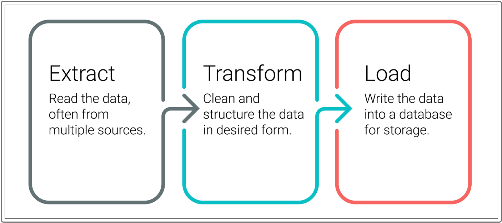
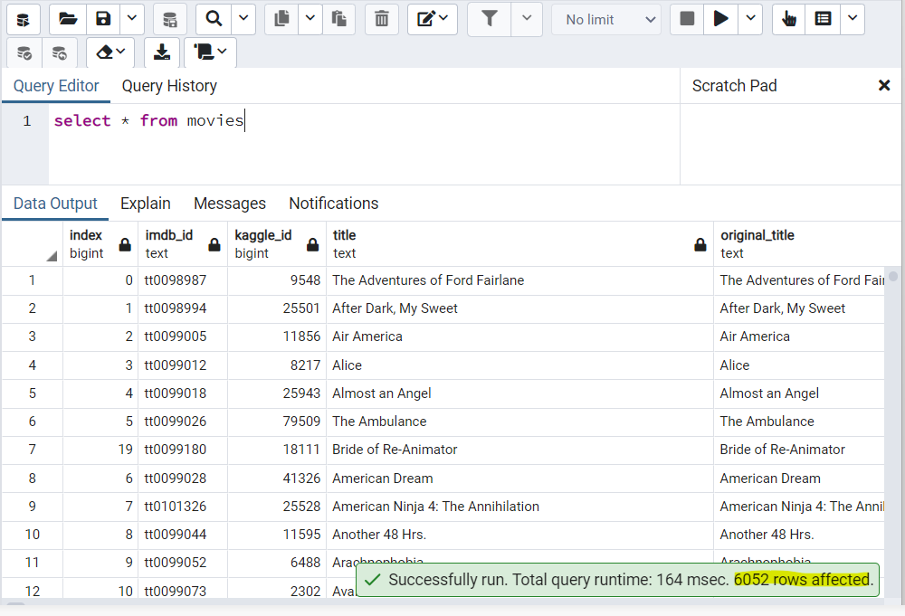
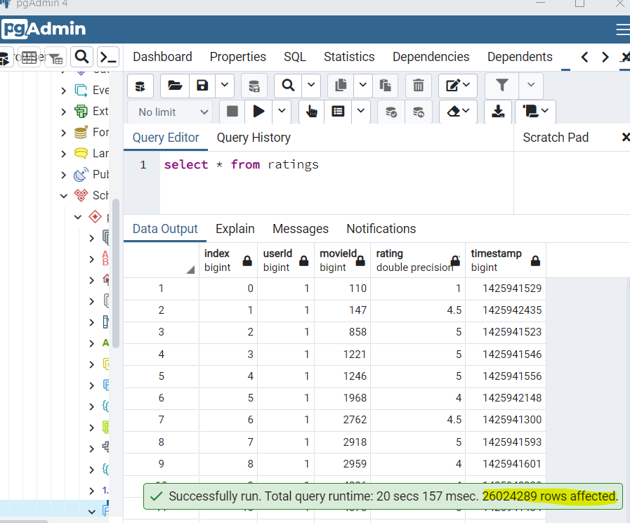

# Movies-ETL

## Overview

### Background
In today's web world there is large amount of data everywhere and in every system used. Not all data is clean and refined. With several people using the same system, with data transfering though one system to other, with loads of data manipulation and many other reasons, the data can get corrupt or entered/stored in different formats.
So when data is collected in one system, we need to clean, process and then store to get most meaningful form of the ***DATA***.
The process of importing data from outside the system, cleaning or processing the data to a meaningful use to the system and then transforming to the system is called as **ETL** process. 
ie. E - Extract, T - Transform and L - Load 

<p align="center">  </p>

### Project Description
The Amazing Prime, a video streaming company, decides to sponsor *hackathon*, where participants trying to predict which low budget movies being released will become popular. Participants of a hackathon need a clean data in order to perform analyses for their algorithms. In order to provide organized and clean dataset, they need to follow **ETL** process:

* Extracting data from two different sources.
	* Wikipedia website for all movies released since 1990 - [wikipedia json file](Resources/wikipedia-movies.json) is provided 
	* data from Kaggle website for rating data. - [Kaggle metadata file](Resources/movies_metadata.csv) and **MovieLens rating data**
* Transforming data using Jupyter Notebook, Python, Pandas and Python RegEx module.
* Loading data using PostgreSQL and pgAdmin to host final cleaned data set

## ETL Process and Code Details
Lets go through each phase of ETL process in detail and how the participants had to create different code files in order to achieve a clean data.

### Step 1 - Extract
Extract - in this step data need to be collected from relevant sources. IT can be from other system tables, web scraped data in form of HTML or JSON files, data from excel, text or any other files of different formats etc. 
Once the relevant data is collected it has to be loaded into an intermediate or say a processing system.

Here participants were given
* The Kaggle dataset pulls from the MovieLens dataset of over 20 million reviews
	* [movies_metadata.csv](Resources/movies_metadata.csv) - Has all movies data 
	* ratings.csv - Has all the Ratings data of each movie *its not uploaded as its very huge file
* Wikipedia
	* [wikipedia-movies.json](Resources/wikipedia-movies.json)- wikipedia scraped data of movies

Let's take a look at code written for this step
[ETL_function_test.ipynb](ETL_function_test.ipynb) - Here we load all the files into a dataframe using a function ***data_transform_load()*** 

``` Python
	def extract_transform_load():
		# 2. Read in the kaggle metadata and MovieLens ratings CSV files as Pandas DataFrames.
		kaggle_metadata = pd.read_csv(kaggle_file, low_memory=False)
		ratings = pd.read_csv(ratings_file, low_memory=False)
		
		# 3. Open the read the Wikipedia data JSON file.
		with open(wiki_file, mode='r') as file:
			wiki_movies_raw = json.load(file)
		# 4. Read in the raw wiki movie data as a Pandas DataFrame.
		wiki_movies_df = pd.DataFrame(wiki_movies_raw)

		# 5. Return the three DataFrames
		return wiki_movies_df, kaggle_metadata, ratings

```

``` Python
	#to call the function
	# 7. Set the three variables in Step 6 equal to the function created in Step 1.
	wiki_file, kaggle_file, ratings_file = extract_transform_load()
	
```

The data is loaded and can be viewed in [wiki_movies_df](Images/Dev11.png) , [kaggle_metadata](Images/Dev12.png) and [ratings](Images/Dev13.png)

### Step 2 - Transform 
Transform - In this step we need to process the data , it can also be called as stagging step where we create some staging tables or dataframes to temporary load the data and perform several cleaning filters and data manupilations.
Below are few ways to process. Each data is different so this processing can vary 

* List all columns and find out relevant columns and keep only those for further processing

* Drop the null data

* Rename columns to more meaningful names, change the datatype of data to have more clean understanding of the data format.

* fetch one column from the dataframe at a time and Process it in seperate Series. Once it is processed then add back to the main dataframe. Drop the original column. 

* Processing of data 
	- Financial data - it can be strored in different formates, so to capture each different format we would need different regular expressions like ``` r'\$\d+\.?\d*\s*[mb]illion' ``` , ``` r'\$\d{1,3}(?:,\d{3})+' ``` and more

	- Date field - Fetch all the well formated date field data using regular expression like ```  r'\d{4}.[01]\d.[0123]\d' ``` , ```  r'\d{4}' ```  and more 

	- Time field - similarly by using RegEx ``` r'^\d*\s*m' ``` , ``` r'(\d+)\s*ho?u?r?s?\s*(\d*)|(\d+)\s*m' ``` and more
	
	- Text filed - this field is used in various ways, list can be stored, any type of data numeric, string, special characters etc. In such case we need to parse one by one.
				 - Make all the list to strings, try to find common format and parse using RegEx, for the unparsed data, if rows are very less it can be dropped or manually modified.
	
* The ETL process, and code refactoring, write a function that reads in the three data files and creates three separate DataFrames. 

	* [ETL_clean_wiki_movies.ipynb](ETL_clean_wiki_movies.ipynb)- Process Wikipedia data 
	* [ETL_clean_kaggle_data.ipynb](ETL_clean_kaggle_data.ipynb) -  Process Kaggle and Ratings data files and then merge with Wikipedia and create [movies_df](Images/Dev33.png)

### Step 3 - Load
Load - In this step the clean, processed data is finally pushed to a Database and stored for the system to use.
This data can also be used for further report generation for predicting or analyses for higher management.

[ETL_create_database.ipynb](ETL_create_database.ipynb) 
* This file connects to SQL database using **sqlalchemy** and **psycopg2** to save the merged movies dataframe **movies_df** to Movies tables. 
* Here we also write a batch process code to import Ratings.csv into ratings table.
The results of load is in below images

#### 1. Movies Table
<p align="center">  </p>

#### 2. Ratings Table
<p align="center">  </p>


## Resources

### Software:

* Python 3.10.2
* Visual Studio Code 1.64.2
* PostgreSQL and PgAdmin

### Dependencies:

* Pandas
* Regex
* Numpy
* Sqlalchemy
